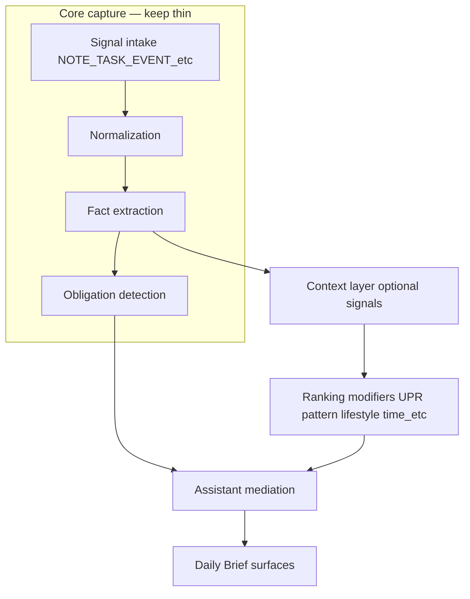

# Expansion sprints 14–20 — attaching context without hardwiring core ingestion

This document traces **where optional intelligence (Sprints 14–20)** should influence the product **without** bolting new mandatory paths into core capture ingestion.

**Authority:** [`AGENTS.md`](../AGENTS.md) — optional signals belong in the **Context Signals Layer**; do not hardwire into core ingestion in early phases. The same rule applies to post-baseline expansion work.

For execution order and gates, see the master expansion pack (`Life_OS_Sprint_13_to_21_Master_Expansion_Pack.md`) and [`docs/roadmap/SPRINTS_13_21_POINTER.md`](./roadmap/SPRINTS_13_21_POINTER.md).

## Continuity pipeline (conceptual)

Core ingestion (**`intakeSignal`** → [`signal-processing-orchestrator`](../apps/api/src/services/signal-processing-orchestrator.ts)) should remain **deterministic** for structured captures. Optional modules contribute **downstream** evidence, confidence hints, and **multipliers**, not required preconditions for accepting a note.

## Approved attachment surfaces (use these)

| Layer | Code anchors | Use for |
| ----- | ------------ | ------- |
| **Suggestion recompute** | [`apps/api/src/services/suggestion-engine.ts`](../apps/api/src/services/suggestion-engine.ts) | `profileRankMultiplier`, `patternRankMultiplier`, `lifestyleRankMultiplier` — add **parallel multipliers** (e.g. behavior rhythm, time-pressure) as small bounded factors |
| **Brief priority** | [`apps/api/src/services/brief-engine.ts`](../apps/api/src/services/brief-engine.ts), [`priority-adaptation-service`](../apps/api/src/services/priority-adaptation-service.ts) | UPR already adjusts brief scores; extend with **explainable** modifiers |
| **Mediation** | [`assistant-mediation-service.ts`](../apps/api/src/services/assistant-mediation-service.ts) | Route / suppress by surface policy; log **AssistantMediationLog** |
| **Insights API (read-only UX)** | [`apps/api/src/routes/v1/insights.ts`](../apps/api/src/routes/v1/insights.ts) | “Why / pattern” bullets — **never** the only source of an obligation |
| **Dedicated domain routes** | `screen-time-summaries`, `place-events`, `errands`, `decisions`, `purchases`, `subscriptions` | CRUD + aggregation; **publish** summary metrics consumed by libs above |
| **Signal envelope (when justified)** | [`signal-intake-service`](../apps/api/src/services/signal-intake-service.ts) | New **`SignalType`** values for **discrete** external summaries (e.g. daily behavior rollup) with **`skipContinuityEffects`** where batching applies — **not** for every line of core user capture |

## Per-sprint mapping (14–20)

| Sprint | Theme | Prefer **not** to… | Prefer **to**… |
| ------ | ----- | ------------------- | --------------- |
| **14** | Screen / behavior | Parse screen pixels or messages in ingestion | Upsert **`ScreenTimeSummary`** (already); add session/window tables → **`BehaviorSummaryService`** output → `patternRankMultiplier` sibling or lifestyle lib |
| **15** | Relationships | Auto-merge people without correction | Extend **`Person`** / relationship routes; **`WeakFollowUpDetection`** → suggestions with **evidence** links; brief hints via mediation |
| **16** | Financial | Import full bank feeds by default | **`Purchase` / `Subscription`** + detection services → obligations/suggestions with **confidence + review-first** duplicates |
| **17** | Lifestyle | Diagnose health | **`routine-scaffolds`**, **`insights`**, opt-in flags → ranking / timing modifiers only |
| **18** | Time allocation | Auto-reschedule calendar | **`planning`** + intent/time block tables → brief explanations + suggestion deferral hints |
| **19** | Errands | Store raw routes | **`errands`**, **`Task.locationHint`**, place catalog from Sprint 13 → clustering service → suggestions |
| **20** | Decisions | Replace user judgment | **`DecisionRecord`** (+ future split tables) → link **`EntityLink`** / obligations → brief “linked decision” lines |

## Anti-patterns

1. **Mandatory `intakeSignal` for every module** — inflates pipeline cost and couples optional domains to Tier 1/2 guards.
2. **Secret weights** — any multiplier that changes rank should be **inspectable** (UPR / adaptation logs / “why” text) per blueprint psychology lens.
3. **Always-on collection** — each module keeps **toggle + purge** in **`UserSettings`** or domain-specific settings (existing pattern: `patternSignalsOptIn`, `lifestyleInsightsOptIn`).

## Testing matrix (cross-cutting)

For each new modifier:

- **Unit:** guard + formula bounds (e.g. multiplier ∈ [0.85, 1.15]).
- **Integration:** opt-in off → behavior identical to baseline recompute for a fixture user.
- **Integration:** correction / purge removes future influence without breaking **`generateDailyBriefForUser`**.

## Related

- Sprint 13 place baseline: [`SPRINT_13_LOCATION_INTAKE_DELTA.md`](./SPRINT_13_LOCATION_INTAKE_DELTA.md)
- Readout extension (Sprint 21): [`SPRINT_21_READOUT_EXTENSION.md`](./SPRINT_21_READOUT_EXTENSION.md)
